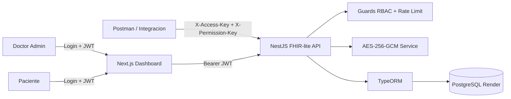

# Arquitectura Base Escalable

## Decisiones tecnicas
- `NestJS` para modularidad, Swagger y crecimiento de API.
- `Next.js App Router` para dashboards diferenciados por rol sobre el mismo frontend.
- `TypeORM + PostgreSQL` para persistencia relacional con FK reales.
- Autenticacion hibrida:
  - `JWT` para la interfaz web.
  - Doble API key para Swagger, Postman e integraciones externas.
- Cifrado simetrico `AES-256-GCM` para `identification_doc` y `medical_summary`.
- `FHIR-lite` para los recursos `Patient` y `Observation`.
- Rate limiting inicial en memoria, preparado para migrar a store distribuido.

## Modulos implementados
- `AuthModule`: login y resolucion de sesion.
- `PatientsModule`: CRUD FHIR-lite de pacientes.
- `ObservationsModule`: CRUD FHIR-lite de observaciones y outliers.
- `AdminModule`: dashboard, gestion de usuarios paciente y API keys.
- `HealthModule`: verificacion operativa.

## Escalamiento siguiente fase
- Separar `doctor_admin` y `doctor` en dos perfiles clinicos distintos.
- Migrar rate limiting a Redis.
- Agregar auditoria por evento y trazabilidad completa.
- Exponer bundles y perfiles FHIR mas cercanos a R4.
- Integrar ingestion de wearables y analitica predictiva.
