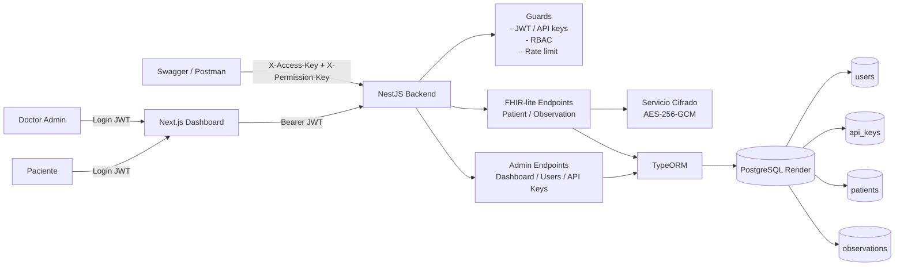

# Diagrama de Arquitectura

```mermaid
flowchart LR
    DA[Doctor Admin] -->|Login JWT| WEB[Next.js Dashboard]
    P[Paciente] -->|Login JWT| WEB
    PM[Swagger / Postman] -->|X-Access-Key + X-Permission-Key| API

    WEB -->|Bearer JWT| API[NestJS Backend]

    API --> AUTH[Guards\n- JWT / API keys\n- RBAC\n- Rate limit]
    API --> FHIR[FHIR-lite Endpoints\nPatient / Observation]
    API --> ADM[Admin Endpoints\nDashboard / Users / API Keys]
    FHIR --> ENC[Servicio Cifrado\nAES-256-GCM]
    FHIR --> ORM[TypeORM]
    ADM --> ORM

    ORM --> DB[(PostgreSQL Render)]

    DB --> T1[(users)]
    DB --> T2[(api_keys)]
    DB --> T3[(patients)]
    DB --> T4[(observations)]
```
