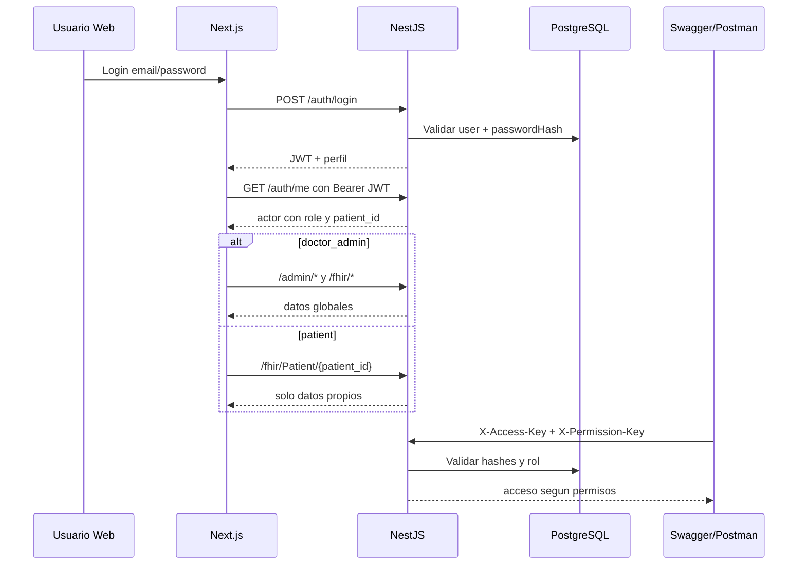

# Flujo de Autenticacion y Autorizacion

```mermaid
sequenceDiagram
    participant User as Usuario Web
    participant Web as Next.js
    participant API as NestJS
    participant DB as PostgreSQL

    User->>Web: Login email/password
    Web->>API: POST /auth/login
    API->>DB: Validar user + passwordHash
    API-->>Web: JWT + perfil
    Web->>API: GET /auth/me con Bearer JWT
    API-->>Web: actor con role y patient_id

    alt doctor_admin
        Web->>API: /admin/* y /fhir/*
        API-->>Web: datos globales
    else patient
        Web->>API: /fhir/Patient/{patient_id}
        API-->>Web: solo datos propios
    end

    participant Postman as Swagger/Postman
    Postman->>API: X-Access-Key + X-Permission-Key
    API->>DB: Validar hashes y rol
    API-->>Postman: acceso segun permisos
```
