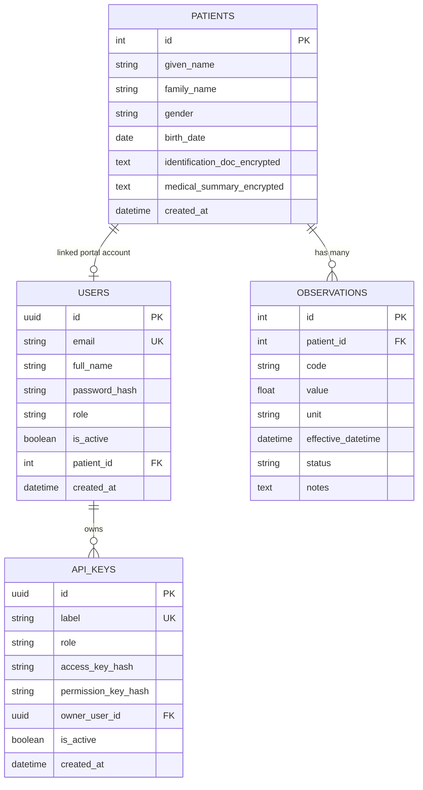

# Diagrama de Base de Datos (ERD)

```mermaid
erDiagram
    USERS {
        uuid id PK
        string email UK
        string full_name
        string password_hash
        string role
        boolean is_active
        int patient_id FK
        datetime created_at
    }

    API_KEYS {
        uuid id PK
        string label UK
        string role
        string access_key_hash
        string permission_key_hash
        uuid owner_user_id FK
        boolean is_active
        datetime created_at
    }

    PATIENTS {
        int id PK
        string given_name
        string family_name
        string gender
        date birth_date
        text identification_doc_encrypted
        text medical_summary_encrypted
        datetime created_at
    }

    OBSERVATIONS {
        int id PK
        int patient_id FK
        string code
        float value
        string unit
        datetime effective_datetime
        string status
        text notes
    }

    PATIENTS ||--o{ OBSERVATIONS : "has many"
    PATIENTS ||--o| USERS : "linked portal account"
    USERS ||--o{ API_KEYS : "owns"
```
